# Lagged Correlation Analysis

Lagged correlation analysis measures the relationship between two time series when one is shifted forward 
or backward in time. It answers questions like : "Does rainfall two months ago correlate with current malaria 
cases?"

## Why use it?

In many real world systems, cause and effect are not simultaneous:

* Rainfall creates mosquito breeding sites 
    -> takes weeks for larvae to become adults 
    -> takes additional weeks for infected mosquitoes to transmit disease.
* An intervention (e.g., bed net distribution) takes time to be used and 
    show impact on cases.

## How It Works (Step by Step)

1. Take two time series of equal length, measured at regular intervals (e.g., monthly):
    * Predictor (X): rainfall, temperature, intervention indicator, etc.
    * Outcome (Y): vector abundance, case count, etc.
2. Shift the predictor series by a lag k (e.g., k = 1 month, k = 2 months, ...).
    * This means: align X(t)​ (rainfall in January) with Y(t+k)​ (cases in March if k=2).
3. Compute the **Pearson correlation** between the shifted predictor and the original outcome.
4. Repeat for different lags (e.g., k = 1, 2, ..., 12 months).
    Plot correlation vs. lag to see which lag gives the strongest (most positive or negative) relationship.

Simple example

| Month | Rainfall (mm) | Cases | Rainfall lag (2 months) | Correlation lag(2) |
| :--- | :--- | :--- | :--- | :--- |
| Jan | 100 | 50 | (no value) | |
| Feb | 80 | 60 | (no value) | |
| Mar | 120 | 90 | 100 (Jan) | 0.85 |
| Apr | 60 | 70 | 80 (Feb) | 0.75 |
| May | 40 | 40 | 120 (Mar) | 0.90 |

The correlation between cases and rainfall lag 2 is computed on 3 overlaping months
(Mar, Apr, May). A high positive value suggest rainfall two month earlier is good
predictor for current cases.

## Mathematic formulae

For a lag $k_k$, the lagged correlation $r_k$​ is:

$r_k = { \sum_{t=k+1}^{n}(X_{t-k} - \overline X)(Y_t - \overline Y)  \over \sqrt{\sum_{t=k+1}^{n}(X_{t-k} - \overline X)^2 \sum_{t=k+1}^{n}(Y_t - \overline Y)^2} }$

Where:
* $X_{t−k}$​ is the predictor value $k$ time steps before the current time $t$.
* $Y_t$​ is the outcome at time $t$.
* $\overline X$, $ \overline Y$ are means over the overlapping period.

Most software (pandas, R, MATLAB) provides a built‑in function.

## Interpretation

| Correlation | Interpretation |
| :--- | :--- |
| Positive & significant | High predictor values $k$ steps ago are associated with high outcome now. |
| Negative & significant | High predictor values $k$ steps ago are associated with low outcome now. |
| Near zero | No linear relationship at that lag. |

Peak correlation (largest absolute value) indicates the most predictive lag. This lag can be used to build a simple early‑warning system.

## Common Pitfalls

* **Spurious correlation** – both series may have trends or seasonality. Remove trends (detrend) or use cross‑correlation function (CCF) which accounts for autocorrelation.
* **Small sample size** – few overlapping points after shifting. Ensure enough data for each lag.
* **Multiple testing** – testing many lags increases chance of finding a random high correlation. Use a significance threshold adjusted for number of lags (e.g., Bonferroni) or simply report the pattern.

## How the CDM could be used

1. aggregate all data to the same temporal resolution (monthly for instance).
2. Join the different facts collected.
3. For each location, shift the predictor columns (temperature, rainfall, intervention flag) by $k$ (1,2,3, ..., n) months .
4. Compute the correlation with outcomes (abundance or cases).
5. Plot the correlation as a function of lag, to identify most influencial time windows.

This directly informs **when** to expect increase in vectors or cases after changes in climate or interventions.


# Common Data Model

## Key differences between CDM and traditional data warehouse

While both are used for integrating and analysing data, they differ in purpose, design philosophy, and usage patterns.

| Aspect | CDM | Data Warehouse |
| :--- | :--- | :--- |
| Primary goal | Standardise semantics (definitions, codes, relationships) across multiple source systems to enable interoperability. | Aggregate and optimise data for reporting and business intelligence (fast queries, historical trends). |
| Scope | Domain‑specific (e.g., healthcare, VBDs). Often driven by a community or consortium. | Organisation‑specific (e.g., sales, finance, logistics). Built for internal decision support. |
| Design approach | Normalised or lightly denormalised – focuses on entity‑relationship integrity and reusability. Tables like location, time, observation are generic. | Highly denormalised (star/snowflake schema) – fact tables with measures, dimension tables for filtering. Optimised for GROUP BY and aggregations. |
| Flexibility / Extensibility | High – new data sources can be added by mapping to existing tables; the model evolves slowly with community input. | Low to medium – schema changes require ETL modifications; designed for stable, predefined reporting needs. |
| ETL complexity | Heavy transformation – source data must be mapped to common codes, units, and structures (e.g., “dengue” → “Dengue fever”). | Heavy integration – cleaning, deduplication, and aggregation, but less semantic harmonisation across disparate domains. |
| Query patterns | Analytical & exploratory – often used with R/Python/SQL for research, machine learning, and flexible joins across many tables. | Operational reporting – pre‑aggregated summaries, dashboards, and standard KPIs. |
| Example tables | location, dim_time, host_case, vector_observation, environmental_factor (star‑like but with many foreign keys). | fact_sales, dim_product, dim_customer, dim_date (strict star schema). |
| Data update frequency | Often batch (daily/weekly) – focused on historical analysis. | Can be real‑time or near‑real‑time (streaming ETL) |
| Community vs. proprietary | Open standard (e.g., OMOP CDM, FHIR). Anyone can implement. | Proprietary to an organisation or vendor (e.g., Snowflake, Redshift). |

``` 
Note: 
A CDM prioritises semantic interoperability – “What does this column mean across hospitals?”

A DWH prioritises query performance – “How fast can I get last year’s sales by region?”
```


## ER Diagram

```mermaid
erDiagram
    DIM_TIME {
        date_id DATE PK
        year INT
        month INT
        week INT
        day_of_year INT
        season VARCHAR
        is_holiday BOOLEAN
    }

    DIM_LOCATION {
        location_code VARCHAR PK
        name VARCHAR
        admin_level VARCHAR
        parent_location_code VARCHAR FK
        geometry_wkt TEXT
        centroid_lat FLOAT
        centroid_lon FLOAT
        country_name VARCHAR
        country_code VARCHAR
    }

    DIM_DISEASE {
        disease_code VARCHAR PK
        disease_name VARCHAR
        description VARCHAR
        source_standard VARCHAR
        pathogen VARCHAR
        icd_code VARCHAR
    }

    DIM_VECTOR {
        vector_code VARCHAR PK
        species_name VARCHAR
        subspecies VARCHAR
        description VARCHAR
        source_standard VARCHAR
        genus VARCHAR
        family VARCHAR
    }

    DIM_INSECTICIDE {
        insecticide_code VARCHAR PK
        insecticide_name VARCHAR
        chemical_class VARCHAR
        description VARCHAR
        source_standard VARCHAR
        irac_group VARCHAR
    }

    DIM_IDENTIFICATION_METHOD {
        method_code VARCHAR PK
        method_name VARCHAR
        method_type VARCHAR
        description VARCHAR
        source_standard VARCHAR
    }

    DIM_RESISTANCE_TEST_TYPE {
        test_type_code VARCHAR PK
        test_type_name VARCHAR
        exposure_time_unit VARCHAR
        description VARCHAR
        source_standard VARCHAR
    }

    DIM_SOCIOECONOMIC_INDICATOR {
        indicator_code VARCHAR PK
        indicator_name VARCHAR
        unit VARCHAR
        source VARCHAR
        description VARCHAR
        source_standard VARCHAR
    }

    DIM_SOURCE {
        source_code VARCHAR PK
        source_name VARCHAR
        source_description VARCHAR
        source_standard VARCHAR
        source_url VARCHAR
        version VARCHAR
    }

    FACT_VECTOR_OBSERVATION {
        observation_id INT PK
        location_code VARCHAR FK
        date_id DATE FK
        vector_code VARCHAR FK
        source_code VARCHAR FK
        life_stage VARCHAR
        sex VARCHAR
        collection_method VARCHAR
        count INT
        density_per_trap FLOAT
        tested_for_pathogen VARCHAR
        infection_status VARCHAR
        infection_rate FLOAT
    }

    FACT_DISEASE_CASE {
        case_id INT PK
        location_code VARCHAR FK
        date_id_onset DATE FK
        date_id_reported DATE FK
        disease_code VARCHAR FK
        identification_method_code VARCHAR FK
        source_code VARCHAR FK
        case_status VARCHAR
        host_type VARCHAR
        age_years INT
        age_group VARCHAR
        sex VARCHAR
        outcome VARCHAR
    }

    FACT_INSECTICIDE_RESISTANCE {
        resistance_id INT PK
        vector_observation_id INT FK
        insecticide_code VARCHAR FK
        test_type_code VARCHAR FK
        source_code VARCHAR FK
        concentration FLOAT
        exposure_time INT
        mortality FLOAT
        resistance_status VARCHAR
    }

    FACT_BIONOMICS {
        bionomics_id INT PK
        vector_observation_id INT FK
        source_code VARCHAR FK
        biting_rate FLOAT
        feeding_preference VARCHAR
        biting_location VARCHAR
        resting_behavior VARCHAR
        larval_site_type VARCHAR
    }

    FACT_INTERVENTION {
        intervention_id INT PK
        location_code VARCHAR FK
        date_start DATE FK
        date_end DATE FK
        target_disease_code VARCHAR FK
        source_code VARCHAR FK
        intervention_type VARCHAR
        coverage FLOAT
    }

    FACT_SOCIOECONOMIC_CONDITION {
        socio_id INT PK
        location_code VARCHAR FK
        year INT
        indicator_code VARCHAR FK
        source_code VARCHAR FK
        indicator_value FLOAT
    }

    FACT_HEALTH_FACILITY {
        facility_id INT PK
        facility_code VARCHAR
        location_code VARCHAR FK
        source_code VARCHAR FK
        name VARCHAR
        lat FLOAT
        lon FLOAT
        type VARCHAR
        catchment_population INT
    }

    FACT_DISEASE_BURDEN {
        burden_id INT PK
        location_code VARCHAR FK
        year INT
        disease_code VARCHAR FK
        source_code VARCHAR FK
        incidence_rate FLOAT
        prevalence_rate FLOAT
        mortality_rate FLOAT
        cases_mean FLOAT
    }

    FACT_ENVIRONMENTAL {
        fact_env_id INT PK
        location_code VARCHAR FK
        date_id DATE FK
        variable VARCHAR
        value FLOAT
        source_code VARCHAR FK
    }

    %% Relationships
    DIM_LOCATION ||--o{ FACT_VECTOR_OBSERVATION : "has"
    DIM_LOCATION ||--o{ FACT_DISEASE_CASE : "has"
    DIM_LOCATION ||--o{ FACT_INTERVENTION : "targets"
    DIM_LOCATION ||--o{ FACT_SOCIOECONOMIC_CONDITION : "measured at"
    DIM_LOCATION ||--o{ FACT_HEALTH_FACILITY : "located in"
    DIM_LOCATION ||--o{ FACT_DISEASE_BURDEN : "estimated for"
    DIM_LOCATION ||--o{ FACT_ENVIRONMENTAL : "has"

    DIM_TIME ||--o{ FACT_VECTOR_OBSERVATION : "recorded at"
    DIM_TIME ||--o{ FACT_DISEASE_CASE : "onset on"
    DIM_TIME ||--o{ FACT_DISEASE_CASE : "reported on"
    DIM_TIME ||--o{ FACT_INTERVENTION : "start on"
    DIM_TIME ||--o{ FACT_INTERVENTION : "end on"
    DIM_TIME ||--o{ FACT_ENVIRONMENTAL : "recorded at"

    DIM_DISEASE ||--o{ FACT_DISEASE_CASE : "diagnosed"
    DIM_DISEASE ||--o{ FACT_INTERVENTION : "targets"
    DIM_DISEASE ||--o{ FACT_DISEASE_BURDEN : "burden for"

    DIM_VECTOR ||--o{ FACT_VECTOR_OBSERVATION : "observed as"

    DIM_INSECTICIDE ||--o{ FACT_INSECTICIDE_RESISTANCE : "tested against"
    DIM_RESISTANCE_TEST_TYPE ||--o{ FACT_INSECTICIDE_RESISTANCE : "used in"
    DIM_IDENTIFICATION_METHOD ||--o{ FACT_DISEASE_CASE : "confirmed by"

    DIM_SOURCE ||--o{ FACT_VECTOR_OBSERVATION : "provides"
    DIM_SOURCE ||--o{ FACT_DISEASE_CASE : "provides"
    DIM_SOURCE ||--o{ FACT_INSECTICIDE_RESISTANCE : "provides"
    DIM_SOURCE ||--o{ FACT_BIONOMICS : "provides"
    DIM_SOURCE ||--o{ FACT_INTERVENTION : "provides"
    DIM_SOURCE ||--o{ FACT_SOCIOECONOMIC_CONDITION : "provides"
    DIM_SOURCE ||--o{ FACT_HEALTH_FACILITY : "provides"
    DIM_SOURCE ||--o{ FACT_DISEASE_BURDEN : "provides"
    DIM_SOURCE ||--o{ FACT_ENVIRONMENTAL : "provides"

    FACT_VECTOR_OBSERVATION ||--o{ FACT_INSECTICIDE_RESISTANCE : "has"
    FACT_VECTOR_OBSERVATION ||--o{ FACT_BIONOMICS : "has"
```




## Database Model documentation

# CDM Data Dictionary

| Table | Field | Type | Description |
|-------|-------|------|-------------|
| **DIM_TIME** | date_id | DATE | Primary key. Unique date identifier in YYYY-MM-DD format. |
| | year | INT | Calendar year. |
| | month | INT | Calendar month (1–12). |
| | week | INT | ISO week number. |
| | day_of_year | INT | Day number within the year (1–366). |
| | season | VARCHAR | Season name (e.g., 'dry', 'wet', 'spring'). |
| | is_holiday | BOOLEAN | Whether the date is a public holiday (true/false). |
| **DIM_LOCATION** | location_code | VARCHAR | Primary key. Unique code for the location (e.g., 'gh_greater_accra'). |
| | name | VARCHAR | Location name (e.g., 'Greater Accra', 'Siaya'). |
| | admin_level | VARCHAR | Administrative level (e.g., 'country', 'region', 'district', 'site'). |
| | parent_location_code | VARCHAR | Foreign key to the parent location (e.g., region for a district). |
| | geometry_wkt | TEXT | Well‑Known Text representation of the location’s boundary or point. |
| | centroid_lat | FLOAT | Latitude of the location’s centroid (WGS84). |
| | centroid_lon | FLOAT | Longitude of the location’s centroid (WGS84). |
| | country_name | VARCHAR | Name of the country where the location resides. |
| | country_code | VARCHAR | ISO 3166‑1 alpha‑2 country code (e.g., 'GH', 'KE'). |
| **DIM_DISEASE** | disease_code | VARCHAR | Primary key. Short code for the disease (e.g., 'MAL', 'DEN'). |
| | disease_name | VARCHAR | Full disease name (e.g., 'Malaria', 'Dengue'). |
| | description | VARCHAR | Optional description of the disease. |
| | source_standard | VARCHAR | Reference to external standard (e.g., 'ICD-10:B54'). |
| | pathogen | VARCHAR | Causal pathogen (e.g., 'Plasmodium falciparum', 'Dengue virus'). |
| | icd_code | VARCHAR | ICD‑10 or ICD‑11 code for the disease. |
| **DIM_VECTOR** | vector_code | VARCHAR | Primary key. Unique code for the vector (e.g., 'ANGAM', 'AEDAE'). |
| | species_name | VARCHAR | Scientific species name (e.g., 'Anopheles gambiae', 'Aedes aegypti'). |
| | description | VARCHAR | Optional description. |
| | source_standard | VARCHAR | Reference to external standard (e.g., 'Darwin Core'). |
| | subspecies | VARCHAR | Subspecies, if applicable (e.g., 'gambiae', 'aegypti'). |
| | genus | VARCHAR | Genus name (e.g., 'Anopheles', 'Aedes'). |
| | family | VARCHAR | Family name (e.g., 'Culicidae'). |
| **DIM_INSECTICIDE** | insecticide_code | VARCHAR | Primary key. Short code for the insecticide (e.g., 'PYR', 'ORG'). |
| | insecticide_name | VARCHAR | Full name (e.g., 'Pyrethroid', 'Organophosphate'). |
| | description | VARCHAR | Optional description. |
| | source_standard | VARCHAR | Reference (e.g., 'IRAC:3A'). |
| | chemical_class | VARCHAR | Chemical class (e.g., 'Pyrethroid', 'Carbamate'). |
| | irac_group | VARCHAR | IRAC group classification for mode of action. |
| **DIM_IDENTIFICATION_METHOD** | method_code | VARCHAR | Primary key. Code for diagnostic method (e.g., 'PCR', 'RDT'). |
| | method_name | VARCHAR | Full method name (e.g., 'Polymerase chain reaction', 'Rapid diagnostic test'). |
| | description | VARCHAR | Optional description. |
| | source_standard | VARCHAR | Reference (e.g., 'LOINC', 'WHO'). |
| | method_type | VARCHAR | Broader category (e.g., 'molecular', 'serological', 'microscopy'). |
| **DIM_RESISTANCE_TEST_TYPE** | test_type_code | VARCHAR | Primary key. Code for bioassay type (e.g., 'WHO', 'CDC'). |
| | test_type_name | VARCHAR | Full name (e.g., 'WHO tube test', 'CDC bottle bioassay'). |
| | description | VARCHAR | Optional description. |
| | source_standard | VARCHAR | Reference (e.g., 'WHO', 'CDC'). |
| | exposure_time_unit | VARCHAR | Unit of exposure time (e.g., 'minutes', 'hours'). |
| **DIM_SOCIOECONOMIC_INDICATOR** | indicator_code | VARCHAR | Primary key. Code for indicator (e.g., 'ITN_USE', 'POVERTY'). |
| | indicator_name | VARCHAR | Full name (e.g., 'Insecticide‑treated net use', 'Poverty rate'). |
| | description | VARCHAR | Optional description. |
| | source_standard | VARCHAR | Reference (e.g., 'UNICEF', 'World Bank'). |
| | unit | VARCHAR | Measurement unit (e.g., '%', 'USD', 'count'). |
| **DIM_SOURCE** | source_code | VARCHAR | Primary key. Short code for the data source (e.g., 'GBIF', 'VA', 'WHO'). |
| | source_name | VARCHAR | Full name of the source (e.g., 'Global Biodiversity Information Facility'). |
| | source_description | VARCHAR | Brief description of the source. |
| | source_standard | VARCHAR | Reference standard or organisation. |
| | source_url | VARCHAR | URL to the source homepage or documentation. |
| | version | VARCHAR | Version of the dataset (e.g., '2024-01', 'v2.1'). |
| **FACT_VECTOR_OBSERVATION** | observation_id | INT | Primary key. Unique identifier for each vector surveillance record. |
| | location_code | VARCHAR | Foreign key to `DIM_LOCATION`. Point location where vector was collected. |
| | date_id | DATE | Foreign key to `DIM_TIME`. Date of observation. |
| | vector_code | VARCHAR | Foreign key to `DIM_VECTOR`. Identifies the vector species/subspecies. |
| | source_code | VARCHAR | Foreign key to `DIM_SOURCE`. Originating data source. |
| | life_stage | VARCHAR | Life stage observed (e.g., 'egg', 'larva', 'pupa', 'adult'). |
| | sex | VARCHAR | Sex of the vector ('male', 'female', 'mixed'). |
| | collection_method | VARCHAR | Method used to collect the vector (e.g., 'CDC light trap', 'BG sentinel'). |
| | count | INT | Number of vectors collected in the sample. |
| | density_per_trap | FLOAT | Calculated density (e.g., vectors per trap per night). |
| | tested_for_pathogen | VARCHAR | Pathogen for which the sample was tested (e.g., 'Plasmodium falciparum'). |
| | infection_status | VARCHAR | Result of pathogen test ('positive', 'negative', 'unknown'). |
| | infection_rate | FLOAT | Proportion of positive vectors in the sample (0–1). |
| **FACT_DISEASE_CASE** | case_id | INT | Primary key. Unique case identifier (can be external ID). |
| | location_code | VARCHAR | Foreign key to `DIM_LOCATION`. Location of patient residence or case report. |
| | date_id_onset | DATE | Foreign key to `DIM_TIME`. Date of symptom onset. |
| | date_id_reported | DATE | Foreign key to `DIM_TIME`. Date the case was reported to authorities. |
| | disease_code | VARCHAR | Foreign key to `DIM_DISEASE`. Disease diagnosed. |
| | identification_method_code | VARCHAR | Foreign key to `DIM_IDENTIFICATION_METHOD`. Method used for confirmation. |
| | source_code | VARCHAR | Foreign key to `DIM_SOURCE`. Originating data source. |
| | case_status | VARCHAR | Status of the case ('suspected', 'probable', 'confirmed'). |
| | host_type | VARCHAR | Type of host ('human', 'animal'). |
| | age_years | INT | Age of the patient in years. |
| | age_group | VARCHAR | Age category (e.g., '0–4', '5–14', '15+'). |
| | sex | VARCHAR | Sex of the patient ('male', 'female', 'other', 'unknown'). |
| | outcome | VARCHAR | Final outcome ('recovered', 'died', 'unknown'). |
| **FACT_INSECTICIDE_RESISTANCE** | resistance_id | INT | Primary key. Unique identifier for each resistance test. |
| | vector_observation_id | INT | Foreign key to `FACT_VECTOR_OBSERVATION`. Links to the vector sample tested. |
| | insecticide_code | VARCHAR | Foreign key to `DIM_INSECTICIDE`. Insecticide tested. |
| | test_type_code | VARCHAR | Foreign key to `DIM_RESISTANCE_TEST_TYPE`. Type of bioassay used. |
| | source_code | VARCHAR | Foreign key to `DIM_SOURCE`. Originating data source. |
| | concentration | FLOAT | Concentration of insecticide used in the test (e.g., µg/mL, %). |
| | exposure_time | INT | Duration of exposure (in units defined by test type). |
| | mortality | FLOAT | Proportion of vectors dead after exposure (0–1). |
| | resistance_status | VARCHAR | Interpreted status ('susceptible', 'confirmed resistance', 'possible resistance'). |
| **FACT_BIONOMICS** | bionomics_id | INT | Primary key. Unique identifier for bionomics record. |
| | vector_observation_id | INT | Foreign key to `FACT_VECTOR_OBSERVATION`. Links to the vector sample. |
| | source_code | VARCHAR | Foreign key to `DIM_SOURCE`. Originating data source. |
| | feeding_preference | VARCHAR | Feeding preference ('anthropophagic', 'zoophagic', 'mixed'). |
| | biting_location | VARCHAR | Location of host contact ('endophagic', 'exophagic', 'mixed'). |
| | resting_behavior | VARCHAR | Where the vector rests after feeding (e.g., 'indoor', 'outdoor'). |
| | larval_site_type | VARCHAR | Type of breeding site (e.g., 'puddle', 'container', 'rice field'). |
| **FACT_INTERVENTION** | intervention_id | INT | Primary key. Unique identifier for each intervention campaign. |
| | location_code | VARCHAR | Foreign key to `DIM_LOCATION`. Geographic area where intervention was deployed. |
| | date_start | DATE | Foreign key to `DIM_TIME`. Start date of the intervention. |
| | date_end | DATE | Foreign key to `DIM_TIME`. End date of the intervention (if applicable). |
| | target_disease_code | VARCHAR | Foreign key to `DIM_DISEASE`. Disease the intervention aims to control. |
| | source_code | VARCHAR | Foreign key to `DIM_SOURCE`. Originating data source. |
| | intervention_type | VARCHAR | Type of intervention (e.g., 'IRS', 'ITN', 'larviciding', 'vaccination'). |
| | coverage | FLOAT | Coverage achieved (e.g., percentage of houses sprayed, nets distributed). |
| **FACT_SOCIOECONOMIC_CONDITION** | socio_id | INT | Primary key. Unique identifier for each socioeconomic record. |
| | location_code | VARCHAR | Foreign key to `DIM_LOCATION`. Area to which the indicator applies. |
| | year | INT | Year of the measurement. |
| | indicator_code | VARCHAR | Foreign key to `DIM_SOCIOECONOMIC_INDICATOR`. The specific indicator. |
| | source_code | VARCHAR | Foreign key to `DIM_SOURCE`. Originating data source. |
| | indicator_value | FLOAT | Numeric value of the indicator (e.g., 42.5 for 42.5% ITN use). |
| **FACT_HEALTH_FACILITY** | facility_id | INT | Primary key. Unique identifier for the health facility. |
| | facility_code | VARCHAR | External code from national master facility list. |
| | location_code | VARCHAR | Foreign key to `DIM_LOCATION`. Administrative region where facility is located. |
| | source_code | VARCHAR | Foreign key to `DIM_SOURCE`. Originating data source. |
| | name | VARCHAR | Name of the facility. |
| | lat | FLOAT | Latitude of the facility (WGS84). |
| | lon | FLOAT | Longitude of the facility (WGS84). |
| | type | VARCHAR | Facility type (e.g., 'hospital', 'clinic', 'dispensary'). |
| | catchment_population | INT | Estimated population served by the facility. |
| **FACT_DISEASE_BURDEN** | burden_id | INT | Primary key. Unique identifier for each burden estimate. |
| | location_code | VARCHAR | Foreign key to `DIM_LOCATION`. Geographic area of the estimate. |
| | year | INT | Year of the estimate. |
| | disease_code | VARCHAR | Foreign key to `DIM_DISEASE`. Disease for which burden is estimated. |
| | source_code | VARCHAR | Foreign key to `DIM_SOURCE`. Originating data source. |
| | incidence_rate | FLOAT | Number of new cases per 1,000 population per year. |
| | prevalence_rate | FLOAT | Proportion of population infected at a given time (0–1). |
| | mortality_rate | FLOAT | Number of deaths per 1,000 population per year. |
| | cases_mean | FLOAT | Mean estimated number of cases (absolute count). |
| **FACT_ENVIRONMENTAL** | fact_env_id | INT | Primary key. Unique identifier for each environmental record. |
| | location_code | VARCHAR | Foreign key to `DIM_LOCATION`. Area for which the variable is measured. |
| | date_id | DATE | Foreign key to `DIM_TIME`. Date of measurement. |
| | variable | VARCHAR | Name of the environmental variable (e.g., 'temperature_mean', 'rainfall_total'). |
| | value | FLOAT | Measured value in standard units (e.g., °C, mm). |
| | source_code | VARCHAR | Foreign key to `DIM_SOURCE`. Originating data source (e.g., 'ERA5'). |


